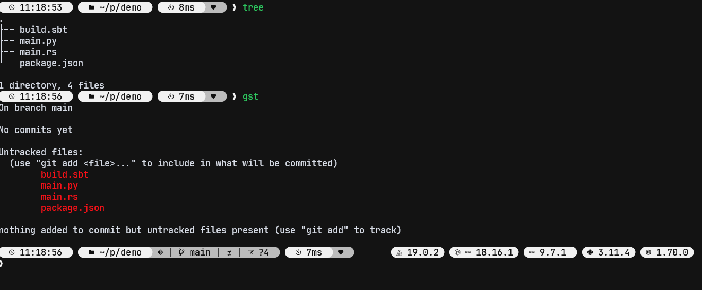

# wahtique's custom ZSH

Dotfiles repo managed using [chezmoi](https://www.chezmoi.io/#considering-using-chezmoi)

## What's included

- plugin list managed with [ZINIT](https://github.com/zdharma-continuum/zinit) adding
  - `ALT+E` to **E**dit or `ALT+R` to **R**ead files chosen with fzf
  - `ALT+\` to jump to previously visitd directory with zoxide interactive mode
  - `CTRL+R` to search command history
  - `fish` like inline auto-complete
  - `fzf` tab completion
  - auto-completion generation from `--help`
- custom `oh-my-posh` theme based on [Dofoerix's theme](https://github.com/Dofoerix/Dfrx-Prompt-Theme)



- [home-manager](https://github.com/nix-community/home-manager) config to setup dependencies
- ~~[LunarVim](https://www.lunarvim.org/) config~~
- [NvChad](https://nvchad.com/) config
- and much more ( well just a little for now but much more soon ! )

Programs are managed using [nix](https://nixos.org/) and [home-manager](https://github.com/nix-community/home-manager).
They can be installed before applying chezmoi's dotfiles for the first time but included install script will try to do if they are not found on your system.

## Installation

- CHECK zsh is your default shell, or set it with `chsh`
- Ensure github is properly setup
  - check [here](https://docs.github.com/en/authentication/connecting-to-github-with-ssh) to setup ssh with your a rsa key
- Fork this repo !
- Install chezmoi (with your github username ofc)

```shell
sh -c "$(curl -fsLS chezmoi.io/get)" -- init --apply $GITHUB_USERNAME
```

- Run `chezmoi apply` and (hopefully) rock'n roll baby !
